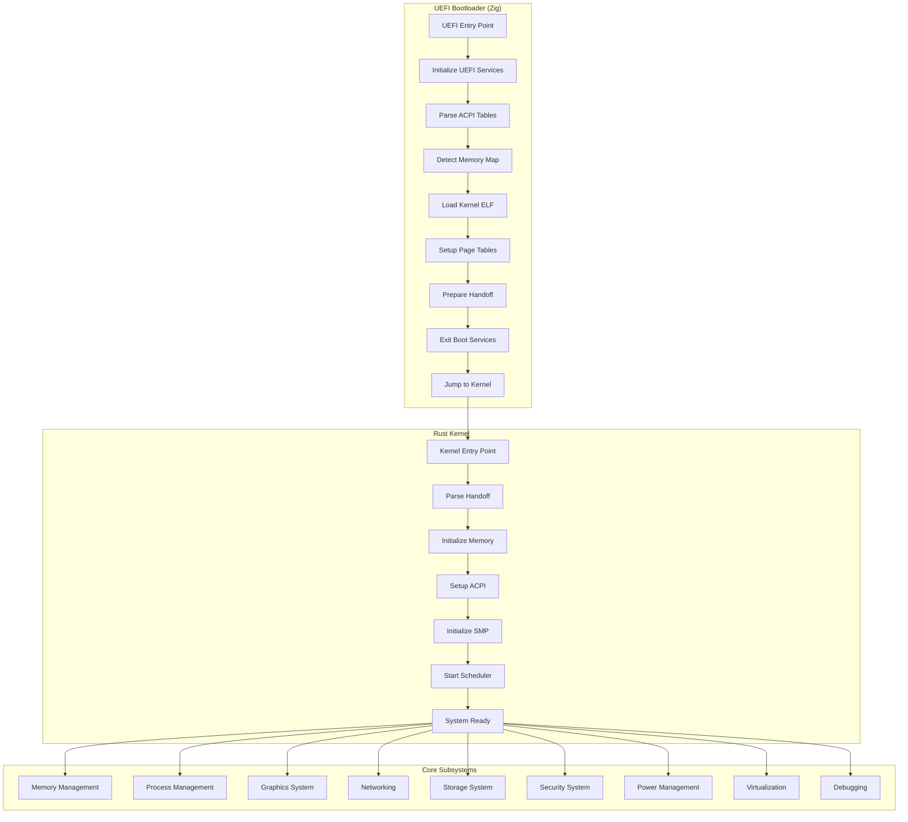

# 🏗️ System Architecture

## 🎯 **Overview**

This document provides a detailed overview of the ultra-advanced UEFI bootloader with Rust kernel system architecture.

## 🚀 **High-Level Architecture**



## 🧠 **Memory Architecture**

### **Virtual Memory Layout**

```
+------------------+ 0xFFFFFFFFFFFFFFFF
| Kernel Stack     |
+------------------+ 0xFFFF800000000000
| Kernel Code      |
| Kernel Data      |
| Kernel Heap      |
+------------------+ 0xFFFF800000000000
| User Space       |
| (Future)         |
+------------------+ 0x0000000000000000
```

### **Physical Memory Layout**

```
+------------------+ 0x100000000 (4GB)
| Higher Memory    |
+------------------+ 0x100000 (1MB)
| Kernel Load      |
+------------------+ 0x100000 (1MB)
| Reserved         |
+------------------+ 0x80000 (512KB)
| Stack            |
+------------------+ 0x7C00 (31KB)
| Boot Sector      |
+------------------+ 0x0000
```

## 🔄 **Boot Process**

### **Phase 1: UEFI Bootloader**

1. **UEFI Entry Point**
   - Initialize UEFI services
   - Get system table and boot services
   - Initialize console output

2. **System Discovery**
   - Parse ACPI tables (RSDP, RSDT/XSDT)
   - Detect memory map using GetMemoryMap
   - Locate SMBIOS entry point
   - Enumerate PCI devices

3. **Kernel Loading**
   - Locate kernel binary (embedded or file-based)
   - Parse ELF64 header and program headers
   - Allocate pages for kernel segments
   - Load kernel into memory

4. **Memory Setup**
   - Set up 4-level page tables
   - Identity map first 4GB
   - Map kernel to higher-half
   - Enable paging and long mode

5. **Handoff Preparation**
   - Create handoff structure
   - Populate with system information
   - Exit boot services
   - Jump to kernel entry point

### **Phase 2: Kernel Initialization**

1. **Entry Point**
   - Receive handoff structure
   - Initialize VGA text buffer
   - Set up basic error handling

2. **Memory Management**
   - Parse memory map from handoff
   - Initialize page table manager
   - Set up heap allocator
   - Enable virtual memory

3. **System Initialization**
   - Parse ACPI tables
   - Initialize APIC and SMP
   - Set up interrupt handling
   - Initialize device drivers

4. **Subsystem Startup**
   - Start task scheduler
   - Initialize graphics system
   - Set up networking stack
   - Enable security features

## 🎯 **Core Subsystems**

### **Memory Management**

- **4-Level Paging**: Complete x86_64 paging implementation
- **Virtual Memory**: Demand paging with swapping
- **Memory Mapping**: mmap/munmap system calls
- **Heap Allocators**: Multiple allocation strategies
- **Memory Protection**: Hardware-enforced protection

### **Process Management**

- **Symmetric Multiprocessing**: Full SMP support
- **Preemptive Multitasking**: Round-robin scheduler
- **System Calls**: POSIX-compatible interface
- **Process Isolation**: Separate address spaces
- **Context Switching**: Full register preservation

### **Graphics System**

- **2D Graphics**: VESA/VBE framebuffer support
- **3D Graphics**: Hardware-accelerated rendering
- **GPU Support**: Modern GPU drivers
- **Shader System**: Custom shaders
- **Animation**: Smooth real-time animation

### **Networking**

- **Protocol Stack**: Complete TCP/IP implementation
- **IPv6 Support**: Next-generation IP
- **TLS/SSL**: Secure communication
- **Firewall**: Network security
- **Routing**: Advanced routing algorithms

### **Storage System**

- **FAT32**: Complete filesystem support
- **RAID**: Software RAID support
- **Encryption**: Full-disk and file encryption
- **Compression**: Transparent compression
- **Journaling**: Transactional filesystem

### **Security System**

- **ASLR**: Address Space Layout Randomization
- **Stack Canaries**: Buffer overflow protection
- **Capability System**: Fine-grained permissions
- **Process Sandboxing**: Isolated execution
- **Memory Encryption**: Hardware-level security

## 🔧 **Hardware Support**

### **Processors**

- **x86_64**: Complete 64-bit support
- **SMP**: Symmetric multiprocessing
- **APIC**: Advanced Programmable Interrupt Controller
- **CPU Features**: SSE, AVX, and other extensions

### **Memory**

- **Up to 4TB**: Virtual memory support
- **NUMA**: Non-Uniform Memory Access
- **Memory Mapping**: Flexible memory layout
- **Cache Management**: CPU cache optimization

### **Storage**

- **ATA/SATA**: Traditional hard drives
- **NVMe**: Solid-state drives
- **USB**: USB mass storage
- **RAID**: Hardware and software RAID

### **Graphics**

- **VESA/VBE**: Standard graphics modes
- **GPU**: Hardware-accelerated graphics
- **Multiple Monitors**: Multi-head display support
- **3D Acceleration**: Hardware 3D support

## 🛡️ **Security Architecture**

### **Memory Security**

- **ASLR**: Address randomization
- **NX Bit**: No-execute bit support
- **Stack Canaries**: Buffer overflow protection
- **Memory Isolation**: Process separation
- **Memory Encryption**: Hardware encryption

### **System Security**

- **Capability System**: Fine-grained permissions
- **Process Sandboxing**: Isolated execution
- **Secure Boot**: UEFI secure boot
- **Encryption**: Data encryption
- **Access Control**: Role-based access

## ⚡ **Performance Architecture**

### **CPU Performance**

- **Context Switch**: < 1μs context switching
- **System Call**: < 100ns system call overhead
- **Interrupt Latency**: < 10μs interrupt response
- **Cache Optimization**: CPU cache efficiency

### **Memory Performance**

- **Page Fault**: < 1μs page fault handling
- **Cache Hit Rate**: > 95% cache hit rate
- **Memory Bandwidth**: Maximum throughput
- **NUMA Optimization**: NUMA-aware allocation

### **I/O Performance**

- **Disk I/O**: High-throughput disk operations
- **Network I/O**: Low-latency network operations
- **Memory I/O**: High-bandwidth memory access
- **DMA**: Direct memory access optimization

## 🔄 **Data Flow**

### **Boot Process Flow**

```
UEFI → Bootloader → Kernel → Subsystems → Applications
```

### **System Call Flow**

```
User → System Call → Kernel → Handler → Response → User
```

### **Interrupt Flow**

```
Hardware → Interrupt → Handler → Processing → Return
```

## 📊 **Performance Characteristics**

### **Boot Time**

- **UEFI to Kernel**: < 100ms
- **Full System Init**: < 500ms
- **Memory Setup**: < 50ms
- **Device Detection**: < 100ms

### **Runtime Performance**

- **Context Switch**: < 1μs
- **System Call**: < 100ns
- **Interrupt Latency**: < 10μs
- **Memory Allocation**: < 100ns

### **Memory Usage**

- **Kernel Size**: < 2MB
- **Bootloader**: < 64KB
- **Runtime Overhead**: < 10MB

## 🎯 **Design Principles**

### **Modularity**

- **Layered Architecture**: Clear separation of concerns
- **Module Independence**: Minimal coupling between modules
- **Interface Definition**: Well-defined APIs
- **Plugin Architecture**: Extensible design

### **Performance**

- **Optimization**: Performance-first design
- **Efficiency**: Minimal resource usage
- **Scalability**: Support for large systems
- **Responsiveness**: Real-time characteristics

### **Security**

- **Defense in Depth**: Multiple security layers
- **Principle of Least Privilege**: Minimal permissions
- **Secure by Default**: Secure default configuration
- **Audit Trail**: Comprehensive logging

### **Reliability**

- **Error Handling**: Comprehensive error management
- **Recovery**: Automatic error recovery
- **Testing**: Extensive testing coverage
- **Monitoring**: Real-time system monitoring

## 🚀 **Future Extensions**

### **Planned Features**

- **Microkernel Architecture**: Move to microkernel design
- **Container Support**: Add containerization
- **Cloud Integration**: Cloud-native features
- **AI/ML Support**: Machine learning capabilities

### **Research Areas**

- **Formal Verification**: Mathematical correctness proofs
- **Quantum Computing**: Quantum algorithm support
- **Edge Computing**: Edge device optimization
- **Neuromorphic Computing**: Brain-inspired computing

---

**This architecture represents the pinnacle of modern operating system design!** 🚀
